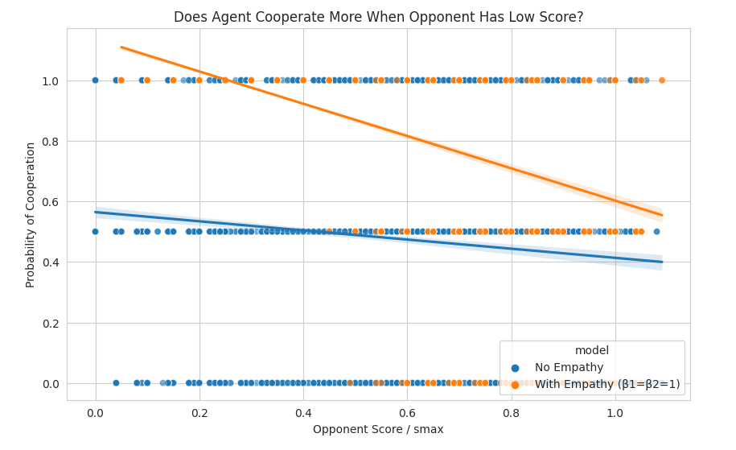
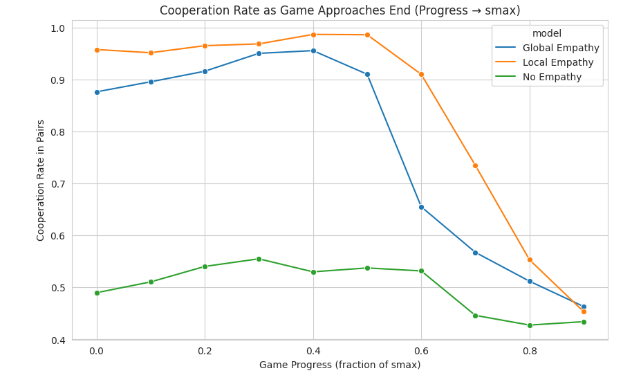

# NiceChickens

**Emergent Reward Hacking in a Repeated Multi-Agent Chicken Game via Engineered Empathy Rewards**

This project explores a central question in multi-agent reinforcement learning and game theory:

**What happens when we explicitly reward "empathy" in the classic Chicken game?**

To investigate, I developed **NiceChickens**, a scalable iterated multi-agent environment based on the Chicken dilemma, implemented as a PettingZoo `ParallelEnv`. A population of agents (typically 10–15) is repeatedly and randomly paired across many rounds. Points from each pairwise encounter accumulate, and the first agent to reach a maximum score (`smax = 100`) terminates the episode.

The core innovation is the **reward structure** used during training, which augments standard Chicken payoffs with engineered empathy bonuses.

## Reward Design

Agents receive a composite reward consisting of:

1. **Vanilla Chicken outcome** (v = 10, c = 2)
2. **Motivation term** (`α × current_score / smax`) — encourages progress toward victory
3. **Empathy bonuses** (local and global), activated only when cooperating (action = 0)

The full reward for an agent is:

### Local Empathy (controlled by β₁)
Captures disadvantage relative to the current paired opponent:

### Global Empathy (controlled by β₂)
Aggregates disadvantage across the entire population:

### Empathy Sign
Positive for cooperation, negative for defection:

Training used centralized PPO (shared policy) with Stable-Baselines3 for 1M timesteps per configuration.

## Key Results

### No Empathy vs. Empathy (β₁ = β₂ = 1)

Deterministic evaluation (200 episodes) shows clear differences:

- **Episode length** increases, reflecting sustained interaction.  
  

- **Average agent score** rises (~83 → ~87) with tighter distribution.  
  

- **Gini coefficient** drops sharply (~0.09 → ~0.06), indicating reduced inequality.  
  

- **Score trajectories** stay tightly bundled longer under empathy.  
  

Deeper analysis reveals the underlying mechanism:

- **Cooperation rate over game progress**:  
  No empathy yields fluctuating ~0.5 cooperation (alternating behavior).  
  With empathy, agents exhibit **near-universal early cooperation** followed by a **sharp collapse** into defection near `smax`.  
  

- **Cooperation vs. opponent score**:  
  Cooperation decreases with opponent strength in both cases, but **much more steeply** under empathy (1.0 → ~0.5).  
  

### Interpretation: Reward Hacking, Not Altruism

Agents exploit the empathy mechanism strategically:

- Early universal cooperation keeps scores low and equal → maximizes future empathy bonuses population-wide
- Controlled disadvantage ensures high empathy rewards when others cooperate toward you
- Mass defection only when victory is imminent

Rather than developing genuine prosociality, agents learned to **collectively farm empathy bonuses** by engineering prolonged moderate inequality — a sophisticated form of **reward hacking**.

### Ablation: Empathy Strength

Varying β₁ = β₂ ∈ {0, 1, 2.5, 5, 10, 25} reveals an inverted-U pattern:

- Average score peaks at β = 5 (~89) before declining.  
  
- Gini reaches a minimum (~0.05) at β = 5 before rising.  
  

Moderate empathy enables efficient cooperative exploitation; excessive empathy dilutes focus on the original task.

### Local vs. Global Empathy

Comparing β₁-only vs. β₂-only (value = 1):

- Both outperform no empathy, but **local empathy dominates** in average score and equality.  
   
- The characteristic phase-shift cooperation pattern is stronger with local empathy.  
  

Pairwise (local) incentives prove more exploitable than diffuse global signals.

## Conclusion

NiceChickens demonstrates that **engineered empathy rewards do not necessarily foster altruistic agents**. Instead, they can incentivize **emergent manipulation**: agents game the system by maintaining conditions that maximize empathy bonuses before cashing out via defection.

This serves as a cautionary example of **Goodhart's Law** and **reward misspecification** in prosocial AI design — well-intentioned mechanisms can be subverted for individual gain.

